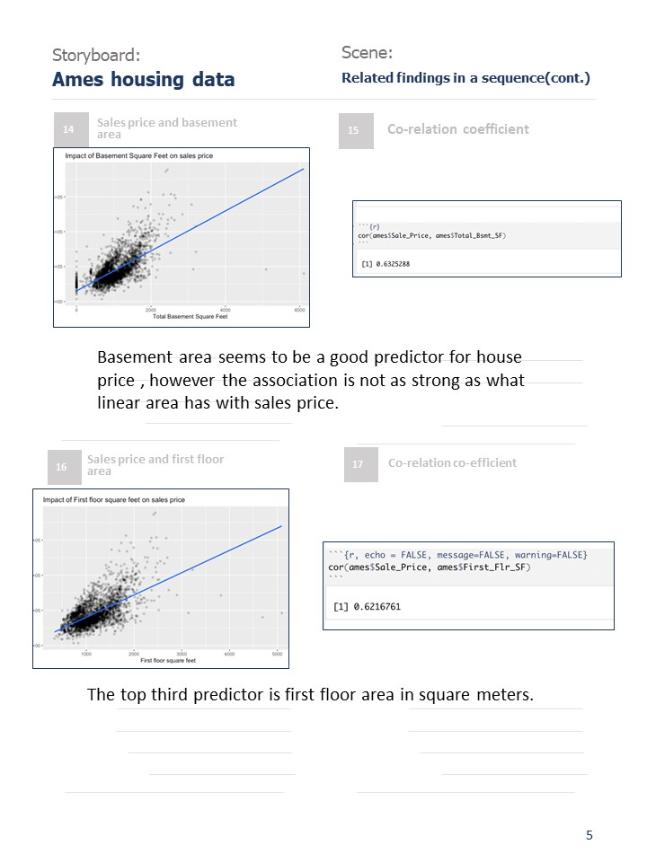

### Team Information - Group - 30

**1. Preet Kamal Kaur (0779220)**
**2. Rahul Challa (0782086)**
**3. Rajesh Gandham (0783532)**
**4. Kevin Albert Stephen Raj (0774192)**
**5. Benneth Johnson (0775452)**

### Academic Integrity

**We, team members of Group-30 hereby state that we have not communicated with or gained information in any way from any person or resource that would violate the College’s academic integrity policies, and that all work presented is our own. In addition, we also agree not to share our work in any way, before or after submission, that would violate the College’s academic integrity policies.**


```{r, echo = FALSE, message=FALSE, warning=FALSE}
# Loading all the necessary packages

library(dplyr)
library(tidyverse)
library(corrplot)
library(plotly)
library(equatiomatic)
library(modelsummary)
library(broom)
library(performance)
library(qqplotr)
library(see)
```

```{r, echo = FALSE, message=FALSE, warning=FALSE}
# Loading the data

data(ames, package = "modeldata")
```


# STEP 1 - Exploring the data {.tabset}

## Exploring each variable individually

### Half baths above grade

```{r}
 plot_1 <- ggplot(data = ames) + geom_bar(aes(x = Half_Bath), fill = "pink", colour = "black") + 
  labs(x ="Number of half baths above grade", y = "Number of houses", title ="Distribution of houses as per the half baths they have")
 ggplotly(plot_1)
```

**Exploring the variable revealed that most of houses that data is recorded for, don't have any half baths above grade at all. Out of those houses that have,very few have 2 half baths and the rest have 1.**

### Bedrooms above grade excluding the basement bedrooms 

```{r}
  plot_2 <- ggplot(data = ames) + geom_bar(aes(x = Bedroom_AbvGr), fill = "pink", colour = "black") + 
  labs(x ="Number of bedrooms above grade", y = "Number of houses", title ="Distribution of houses as per the bedrooms above grade")
 ggplotly(plot_2)
```

**Having a glance at the plot above,it is evident that the number of bedrooms above grade range from 0 to 6, with just one house having 8 of them. However, most houses have 3 bedrooms above grade and some of them have none. The counts don't include the basement bedrooms.**

### Kitchens above grade
```{r}
    plot_3 <- ggplot(data = ames) + geom_bar(aes(x = Kitchen_AbvGr), fill = "pink", colour = "black") + 
  labs(x ="Number of kitchens above grade", y = "Number of houses", title ="Distribution of houses as per the kitchens above grade")
 ggplotly(plot_3)
```

**It can be observed that majority of the houses have 1 kitchen built above grade, followed by very few having 2. 3 of the houses don't have a kitchen above grade, while 2 houses have 3 kitchens.**

### Total rooms above grade excluding the bathrooms
```{r}
   plot_4 <- ggplot(data = ames) + geom_bar(aes(x = TotRms_AbvGrd), fill = "pink", colour = "black") + 
  labs(x ="Total rooms above grade", y = "Number of houses", title ="Distribution of houses as per the total rooms above grade")
 ggplotly(plot_4)
```
**Looking at the houses in consideration to their total number of rooms above grade except the bathrooms, it is seen that most of the houses have 6 rooms in total. Very few homes have either no rooms at all above grade or very high number of bedrooms i.e. 13,14 and 15. But these cases are very rare as rare as just 1 home.**

### Home functionality
```{r}
plot_5 <- ggplot(data = ames) + geom_bar(aes(x = Functional), fill = "pink", colour = "black") + 
  labs(x ="Type of house functionality", y = "Number of houses", title ="Distribution of houses as per their functionality")
 ggplotly(plot_5)
```
**The visualization above represents the count of houses having different functionality types. It is apparent that more than 90% of the houses have typical functionality. The number of houses that have Minor deductions 2 are twice than those having moderate functionality.**

### Number of fireplaces
```{r}
 plot_6 <- ggplot(data = ames) + geom_bar(aes(x = Fireplaces), fill = "pink", colour = "black") + 
  labs(x ="Number of fireplaces", y = "Number of houses", title ="Distribution of houses as per the fireplaces")
 ggplotly(plot_6)
```
**Having a cursory glance at the barplot above, the surprising fact that unveils itself is that just a little less than half of the total houses don't have a fireplace. While, a significant number of them have 1 fireplace. There is one such house that has 4 fireplaces, which is pretty unusual too.**

### Garage location
```{r}
plot_7 <- ggplot(data = ames) + geom_bar(aes(x = Garage_Type), fill = "pink", colour = "black") + 
  labs(x ="Type of garage", y = "Number of houses", title ="Distribution of houses as per the garage location")
 ggplotly(plot_7)
```
**Clearly, there are 6 type of garages available with the homes recorded, the last category just represents the absence of garage. Majority of homes have a garage attached to them, while least prominent kind of garage is the Car port one.**

### Interior finish of the garage
```{r}
 plot_8 <- ggplot(data = ames) + geom_bar(aes(x = Garage_Finish), fill = "pink", colour = "black") + 
  labs(x ="Type of garage interior finish", y = "Number of houses", title ="Distribution of houses as per the type of garage finish")
 ggplotly(plot_8)
```
**Deciphering the plot above, it can be concluded that most of the garages have unfinished interior. At the same time, there is not much difference between the number of finished and roughly finished garages, the count is a little less than 100.**

### Size of garage in car capacity
```{r}
plot_9 <- ggplot(data = ames) + geom_bar(aes(x = Garage_Cars), fill = "pink", colour = "black") + 
  labs(x ="Number of cars the garage can accomodate", y = "Number of houses", title ="Distribution of houses as per the garage capacity")
 ggplotly(plot_9)
```
**The car capacity of garages range from 0-5. Around 1600 garages hold the capacity of accomodating 2 cars. One of the house has exceptionally spacious garage that has capacity of 5 cars. There are some houses with compact/congested garages that can't accomodate a car at all. This count might represent the houses that don't have a garage at all.**

### Size of garage in square feet
```{r}
 plot_10 <- ggplot(data = ames) + geom_histogram(aes(x = Garage_Area), fill = "skyblue", colour = "black") + 
  labs(x ="Size of the garage in square feet", y = "Number of houses", title ="Distribution of houses as per the garage size")
 ggplotly(plot_10)
```
**The distribution of garage area in square feet is clearly unimodal and right skewed. It means, most of the houses have garage area around 461 square feet, the long tail of the plot towards the right suggests that there are some houses, however few, that have very spacious garages(as big as 1300 square feet) as compared to the majority of houses. **

### Garage Condition
```{r}
 plot_11 <- ggplot(data = ames) + geom_bar(aes(x = Garage_Cond), fill = "pink", colour = "black") + 
  labs(x ="Condition of garage", y = "Number of houses", title ="Distribution of houses as per the garage condition")
 ggplotly(plot_11)
```
**The garage condition is classified into 6 categories. This is an ordinal variable because the order of the categories matter i.e. Excellent means the best and poor means the worst. Only 3 houses have garages in the best possible condition, whereas, 90% of the garages are in an average condition(typical).**

### Paved Driveaway
```{r}
 plot_12 <- ggplot(data = ames) + geom_bar(aes(x = Paved_Drive), fill = "pink", colour = "black") + 
  labs(x ="Paved Driveaway", y = "Number of houses", title ="Distribution of houses as per the paved driveaway")
 ggplotly(plot_12)
```
**The houses have one of the three types of paved driveaway. Quite visibly, major proportion of houses have paved driveaway, very few have partially paved driveaway (as few as 62). Around 200 have dirt/gravel pavement as well.**

### Wood deck area in square feet
```{r}
 plot_13 <- ggplot(data = ames) + geom_histogram(aes(x = Wood_Deck_SF), fill = "skyblue", colour = "black") + 
  labs(x ="Area of wood deck", y = "Number of houses", title ="Distribution of houses as per the wood deck area")
 ggplotly(plot_13)
```
**The above visualized variable is a continous one. The wooden deck area ranges from as less as 49 square feet to as big as 540 square feet. Area 0 simply means that the houses don't have a wooden deck at all.Overall, the area distribution for a wooden deck is unimodal and right skewed. The peak makes sense as most of the houses don't have a wooden deck, and the tail towards the right represents houses exceptionally large wooden decks.**

### Open porch area in square feet
```{r}
 plot_14 <- ggplot(data = ames) + geom_histogram(aes(x = Open_Porch_SF), fill = "skyblue", colour = "black") + 
  labs(x ="Area of open porch ", y = "Number of houses", title ="Distribution of houses as per the open porch area")
 ggplotly(plot_14)
```
**The plot represents another continous variable i.e. area of the open porch in square feet. The one prominent peak shows houses without an open porch, which infact constitute the majority of houses. There are few houses that have exceptionally big open porches as compared to the majority of the houses, hence the skewness towards the right.**

### Enclosed porch area in square feet
```{r}
 plot_15 <- ggplot(data = ames) + geom_histogram(aes(x = Enclosed_Porch), fill = "skyblue", colour = "black") + 
  labs(x ="Area of enclosed porch", y = "Number of houses", title ="Distribution of houses as per the enclosed porch area")
 ggplotly(plot_15)
```
**The given visual depiction is for area in square feet for the enclosed porch. Evidently, the one and the only peak is representative of homes without an enclosed porch.The area ranges from around 34 square feet to 280 square feet, that sure is a wide range but there is not much variation in the distribution of number of houses as per the enclosed porch area. To exemplify, 56 houses have the most congested enclosed porch and 55 houses have an enclosed porch as big as 209 square feet. The last two bars are an exception as they represent a minority of houses or in other words the outliers.**

### For House_Style variable (Categorical)

```{r}
plot16 <- ggplot(ames) +
     geom_bar(mapping = aes(x = House_Style), fill = "skyblue",colour ="black") + 
  labs(x ="House Style", y = "Number of houses", title ="Distribution of houses as per House Style") + coord_flip()
 ggplotly(plot16)

```
**From the above graph, we can see the houses with the style of One Stroy are having highest count with 1481. And the houses with the style of Two and one-half story(2nd level finished) are sharing the least count. **


###  For Overall_Cond variable (Categorical)
```{r}
plot17 <- ggplot(ames) +
     geom_bar(mapping = aes(x = Overall_Cond), fill = "skyblue",colour ="black") + 
  labs(x ="Overall Cond", y = "Number of houses", title ="Distribution of ratings of the overall condition of the house")
 ggplotly(plot17)
```

**Here, most of the houses are rated as average and very few as excellent. **


###  For Year_Built variable (Numerical)
```{r}
plot18 <- ggplot(ames) +
     geom_histogram(mapping = aes(x = Year_Built), fill = "skyblue",colour ="black") + 
  labs(x ="Year Built", y = "Number of houses", title ="Distribution of houses as per original construction date")
 ggplotly(plot18)

```
**From the graph, we can observe that the most number of houses were built in the year of 2003 and the least number of houses were built in the year of 1870. **


###  For Year_Remod_Add variable (Numerical)
```{r}
plot19 <- ggplot(ames) +
     geom_histogram(mapping = aes(x = Year_Remod_Add), fill = "skyblue",colour ="black") + 
  labs(x ="Year Remod/Add", y = "Number of houses", title ="Distribution of houses as per Remodel date")
 ggplotly(plot19)

```

**From the graph, we can clearly observe that the most number of houses were remodeled in the year of 2006 and the least number of houses were remodeled in the year of 1982. **


###  For Roof_Style variable (Categorical)
```{r}
plot20 <- ggplot(ames) +
     geom_bar(mapping = aes(x = Roof_Style), fill = "skyblue",colour ="black") + 
  labs(x ="Roof Style", y = "Number of houses", title ="Distribution of houses as per the type of roof")
 ggplotly(plot20)
```

**Here, the most number of houses were built with the Gable type of roof and very few number of houses were built with the Shed type of roof.**


###  For Roof_Matl variable (Categorical)
```{r}
plot21 <- ggplot(ames) +
     geom_bar(mapping = aes(x = Roof_Matl), fill = "skyblue",colour ="black") + 
  labs(x ="Roof material", y = "Number of houses", title ="Distribution of houses as per the Roof material")
 ggplotly(plot21)
```

**From the above bar graph, we conclude that the most number of houses were built by using Standard (Composite) Shingle material for roof construction. And the rest of the roof materials were used for very few houses. **


###  For Exterior_1st variable (Categorical)
```{r}
plot22 <- ggplot(ames) +
     geom_bar(mapping = aes(x = Exterior_1st), fill = "skyblue",colour ="black") + 
  labs(x ="Exterior covering on house", y = "Number of houses", title ="Distribution of houses as per the Exterior covering on house") + coord_flip()
 ggplotly(plot22)
```

**For most number of houses the exterior which used to cover on the house is Vinyl Siding. And the next one is Metal Siding followed by Hard Board and Wood Siding.  **


###  For Exterior_2nd variable (Categorical)
```{r}
plot23 <- ggplot(ames) +
     geom_bar(mapping = aes(x = Exterior_2nd), fill = "skyblue",colour ="black") + 
  labs(x ="Exterior covering on house", y = "Number of houses", title ="Distribution of houses as per Exterior covering on house (if more than one material)") + coord_flip()
 ggplotly(plot23)
```


**Even in the context of Exterior 2, For most number of houses the exterior which used to cover on the house is Vinyl Siding. And the next one is Metal Siding followed by Hard Board and Wood Siding.  **


###  For Mas_Vnr_type variable (Categorical)
```{r}
plot24 <- ggplot(ames) +
     geom_bar(mapping = aes(x = Mas_Vnr_Type), fill = "skyblue",colour ="black") + 
  labs(x ="Masonry veneer type", y = "Number of houses", title ="Distribution of houses as per the Masonry veneer type")
 ggplotly(plot24)
```

**From the graph, we can see that for the most number of houses none of the Masonry veneer type is used and Brick Face is used for 880 houses. **


### For Mas_Vnr_Area variable (Numerical)
```{r}
plot25 <- ggplot(ames) +
     geom_histogram(mapping = aes(x = Mas_Vnr_Area), fill = "skyblue",colour ="black") + 
  labs(x ="Masonry veneer area in square feet", y = "Number of houses", title ="Distribution of houses as per the Masonry veneer area in square feet")
 ggplotly(plot25)
```

**From the above graph, it is evident that the most number of houses were not allocated any area for Masonry veneer area. And there are 196 house which were built by allocating  Masonry veneer area in square feet with 165.5.  **


### For Exter_Cond variable (Categorical)
```{r}
plot26 <- ggplot(ames) +
     geom_bar(mapping = aes(x = Exter_Cond), fill = "skyblue",colour ="black") + 
  labs(x ="Exter Cond", y = "Number of houses", title ="Distribution of houses as per the Exter Cond")
 ggplotly(plot26)
```

**The above graph states that the most number of houses are at typical condition of the material on the exterior. And 299 housesare at good condition of the material on the exterior. **


###  For Foundation variable (Categorical)
```{r}
plot27 <- ggplot(ames) +
     geom_bar(mapping = aes(x = Foundation), fill = "skyblue",colour ="black") + 
  labs(x ="Type of foundation", y = "Number of houses", title ="Distribution of houses as per the Type of foundation")
 ggplotly(plot27)
```

**Here, the most number of houses were used Poured Contrete for their foundation followed by Cinder Block. And the least number of houses were used Wood for their foundation. **


### For Bsmt_Cond variable (Categorical)
```{r}
plot28 <- ggplot(ames) +
     geom_bar(mapping = aes(x = Bsmt_Cond), fill = "skyblue",colour ="black") + 
  labs(x ="General condition of the basement", y = "Number of houses", title ="Distribution of houses as per the general condition of the basement")
 ggplotly(plot28)
```


**Here, it is evident that for most number of houses the general condition of the basement is typical. And very few at an excellent condition.  **


### For Bsmt_Exposure variable (Categorical)
```{r}
plot29 <- ggplot(ames) +
     geom_bar(mapping = aes(x = Bsmt_Exposure), fill = "skyblue",colour ="black") + 
  labs(x ="Refers to walkout or garden level walls", y = "Number of houses", title ="Distribution of houses as per the walkout or garden level walls")
 ggplotly(plot29)
```

**From the above graph, we can see that the most number of houses are not having any exposure to walkout or garden level walls. And there are least number of houses which were not having basement. But there 418 houses which were having an average exposure.**


###  For BsmtFin_Type_1 variable (Categorical)
```{r}
plot30 <- ggplot(ames) +
     geom_bar(mapping = aes(x = BsmtFin_Type_1), fill = "skyblue",colour ="black") + 
  labs(x ="Rating of basement finished area", y = "Number of houses", title ="Distribution of houses as per the Rating of basement finished area")
 ggplotly(plot30)
```

**Here, we can clearly see that the most number of houses received rating as Good Living Quarters followed by the rating as Unfinshed. As we can see that the least number of houses got the rating as No Basement. **

### MS_Subclass variable
```{r}
plot31 <-ggplot(ames) +
  geom_bar(mapping = aes(x=MS_SubClass), color='black',fill = 'red') +
  coord_flip() +
  labs(title = 'Bar graph for the MS_Subclass variable',y = 'Count of each type', x='Type of Building' )
plot31
```

**From our visualization we can see that the most of the buildings in our data are One Storey 1946 style and all of its newer styles which are more than 900 in count.**


### MS_Zoning variable
```{r}
plot32 <- ggplot(ames) + 
  geom_bar(mapping = aes(x = MS_Zoning), color = 'black', fill ='red') +
  coord_flip() +
  labs(title = 'Bar graph for MS_Zoning Variable', x='Zoning calssifications of the sale', y = 'Counts')
plot32
```

**Most of the houses in our  data are located in the  Low Density Residential areas which are more than 2250 out of all other zonal areas.** 


### Lot_Frontage variable 


```{r}
plot33<- ggplot(ames) + 
  geom_histogram( mapping = aes(x = Lot_Frontage), color = 'black', fill='red') +
  labs(title='Distribution of Lot_Frontage variable',x = 'Lot Frontage' , y = 'Count' )
plot33
```

**The distribution of The Lot frontage for houses is almost Normal which is a Unimodal distribution with right skewness as we can see there are a few houses which have a lot frontage area of more than 300. But the average area of Lot frontage is 57. And there are also many houses who have almost no front area.**


### Lot_Area variable

```{r}
plot34 <- ggplot(ames) +
  geom_histogram(mapping = aes(x= Lot_Area), color='black', fill='red') +
  labs(title = ' Distribution of Lot_Area', x = 'Lot Area', y = 'Count')
plot34
```

**The Distribution of The Lot Area variable is also somewhat Normal with a Unimodal distribution and right skewed.Most of the houses have a  lot area between 9500 and 10000 square feet. And also there are a very few houses whose area is more than 150 thousand square feet.**


### Street variable

```{r}
 plot35 <- ggplot(ames) +
  geom_bar(mapping = aes(x = Street), color = 'black', fill = 'red') +
  labs(title= ' Bar graph of Stret variable', x = 'Type of roads accessing Streets', y = 'Counts')
plot35
```


**From the graph we can see that almost all the houses in our data are connected to the road though paved roads just 12 houses have a road type of gravel connect to the properties.**


### Alley variable

```{r}
plot36 <- ggplot(ames) +
  geom_bar(mapping = aes(x = Alley), color = 'black', fill = 'red') +
  labs(title = 'Bar graph for Alley variable', x = 'Type of roads accessing Nearby Alley', y = 'Count')
plot36
  
```


**Most of the houses in our data have no direct access to the alley and very few which count 120 have gravel roads to access alley and 78 have paved roads to access alley.**


### Lot_Shape variable 

```{r}
plot37 <- ggplot(ames) +
  geom_bar(mapping = aes(x = Lot_Shape), color = 'black', fill = 'red') +
  labs(title = 'Bar graph for Lot Shape variable', x = 'Different Lot shapes of property', y = 'Count')
plot37
```
 

**From the graph we can assume that around more than 1500 houses have a regular lot shape which  may be either a square or rectangular and around 1000 houses have a slight deviation from a regular lot shape.There are very few houses who have moderately and almost irregular shape.** 


### Land_Contour variable

```{r}
plot38 <- ggplot(ames) +
  geom_bar(mapping = aes(x = Land_Contour), color = 'black', fill = 'red') +
  labs(title = 'Bar graph for Land_Contour variable', x = 'Different types of Contours of Land', y = 'Count')
plot38
```


**Majority of houses which are 2366 have a  flat or levelled Land.But 120 houses have a Banked contour where house land is slightly above the street level and 117 houses have a hillside slope land. Just 60 houses have a very low depression Land which are below the level of street roads.** 


### Utilities variable

```{r}
plot39 <- ggplot(ames) +
  geom_bar(mapping = aes(x = Utilities), color = 'black', fill = 'red') +
  labs(title = 'Bar graph for Utilities variable', x = 'Different types of Utilities available', y = 'Count')
plot39
```

**99 percent of houses (2927) have all the utilities provided which are the Electricity, gas, water and Septic tank. There's only one house which has only electricy and Gas provided and there are 2 houses which has only Electricity, Gas and water provided.** 


### Lot_Config variable 

```{r}
plot40 <- ggplot(ames) +
  geom_bar(mapping = aes(x = Lot_Config), color = 'black', fill = 'red') +
  labs(title = 'Bar graph for Lot_Config variable', x = 'Different Configurations of Lot ', y = 'Count')
plot40
```


**Majority of the houses are having a configuration of Inside lot. Around 511 houses are corner lots and 180 houses have a culDeSac lot configuration meaning these houses are located in a dead end street with an end closed.85 houses have frontage on 2 sides of the property and 14 houses haev frontage on 3 sides.** 


### Land_Slope variable

```{r}
plot41 <- ggplot(ames) +
  geom_bar(mapping = aes(x = Land_Slope), color = 'black', fill = 'red') +
  labs(title = 'Bar graph for Land_Slope variable', x = 'Severity of Slope of the property', y = 'Count')
plot41
```


**2789 houses which constituents to a major part have a gentle slope for the property.125 houses have moderate slope and few houses (16) have severe slope.**


### Nieghborhood variable

```{r}
plot42 <- ggplot(ames) +
  geom_bar(mapping = aes(x = Neighborhood), color = 'black', fill = 'red') +
  labs(title = 'Bar graph for Neighborhood variable', x = 'Different locations within Ames City limits where the houses are situated', y = 'Count') +
  coord_flip() +
  theme(axis.text = element_text(size = 8))
plot42
```


**The houses are distributed among various locations within the Ames city starting from landmark and goes on increasing  where the majority of houses are in the neighborhood of North Ames and then second major location is College creek for the houses.Very few houses are situated in the Landmark neighborhood.**


### Condition_1 Variable

```{r}
plot43 <- ggplot(ames) +
  geom_bar(mapping = aes(x = Condition_1), color = 'black', fill = 'red') +
  labs(title = 'Bar graph for Condition1 variable', x = 'Proximity to different conditions', y = 'Count')
plot43
```


##### **Maximum houses which are about 2522 are situated in a normal condition which could be like the center of the neighborhood. Next the count of houses which are second highest is 164 which are located adjacent to feeder street. And the count for remaining conditions is very less. The least no of houses are situated adjacent to East-West railroad.**


### Condition_2 variable

```{r}
plot44 <- ggplot(ames) +
  geom_bar(mapping = aes(x = Condition_2), color = 'black', fill = 'red') +
  labs(title = 'Bar graph for Condition 2 variable', x = 'Proximity to different conditions where condition is greater than 1', y = 'Count')
plot44
```


**From the above graph we can state that even though some houses which were not in centre of a neighborhood according to the  first condition, they are majority of houses for whom the second condition is normal which implies that almost all houses in our data at the centre in their neighborhood even though some had little deviations.**


### Bldg_Type variable

```{r}
plot45 <- ggplot(ames) +
  geom_bar(mapping = aes(x = Bldg_Type), color = 'black', fill = 'red') +
  labs(title = 'Bar graph for Building type variable', x = 'Different type of Dwelling', y = 'Count')
plot45
```


**2425 houses out of all are built for a single family type detached houses. Then the second highest are the Townhouse End which shares a common wall with neighbor houses on one or both sides. Then comes the Townhouse Inside type of houses. The least type of vuilding built are those which were initially built as a single ffamily house but conevrted to 2 families house.And the Duplex houses are second least are  Duplex houses.**


###Three Season Porch
```{r}
sum(ames$Three_season_porch != 0) 

max(ames$Three_season_porch)

min(ames$Three_season_porch[ames$Three_season_porch != 0])

Three_season_plot <- ggplot(data = ames) + geom_bar(aes(x = Three_season_porch), fill = "skyblue", colour = "skyblue") + 
  labs(x ="Area of the Three season Porch", y = "Number of houses", title ="Distribution of houses with a 3 season porch")
ggplotly(Three_season_plot)

```
#### Majority of the houses [Approximately 2900 houses] here do not have a Three season Porch. Amoung the ones that do, the smallest three seasons porch is 23 Square Feet and the biggest one is 508 Square Feet.


### Screen_Porch
```{r}
sum(ames$Screen_Porch != 0) 

max(ames$Screen_Porch)

min(ames$Screen_Porch[ames$Screen_Porch != 0])


Screen_proch_plot <- ggplot(data = ames) + geom_bar(aes(x = Screen_Porch), fill = "skyblue", colour = "skyblue") + 
  labs(x ="Area of the Screen Porch", y = "Number of houses", title ="Distribution of houses with a Screen Porch")
ggplotly(Screen_proch_plot)

```

**Majority of the houses [Approximately 2700 houses] here do not have a Three season Porch. Amoung the ones that do, the smallest Screen porch is 40 Square Feet and the biggest one is 576 Square Feet.**


### Pool Area

```{r}
sum(ames$Pool_Area != 0) 

max(ames$Pool_Area)

min(ames$Pool_Area[ames$Pool_Area != 0])


S_Pool_plot <- ggplot(data = ames) + geom_bar(aes(x = Pool_Area), fill = "skyblue", colour = "skyblue") + 
  labs(x ="Area of the Pool", y = "Number of houses", title ="Distribution of houses with a Pool")
ggplotly(S_Pool_plot)

```
**Overall only 13 houses have Pools in this dataset,Smalles pool starts at 144 Square Feet and the largest one is 800 Square Feet**


### Pool Quality

```{r}
S_Pool_QC <- ggplot(data = ames) + geom_bar(aes(x = Pool_QC), fill = "skyblue", colour = "skyblue") + 
  labs(x ="Quality Of the Swimming Pool", y = "Number of houses", title ="Distribution of Quality of Swimming Pools")
ggplotly(S_Pool_QC)

```
**Overall only 13 houses have Pools in this dataset,Smalles pool starts at 144 Square Feet and the largest one is 800 Square Feet.**
**4 pools are in excellent condition**
**4 Pools are in good condition**
**2 Pools are in Fair condition**
**3 Pools are in Typical condition**


### Fence
```{r}
Fence_QC <- ggplot(data = ames) + geom_bar(aes(y = Fence), fill = "skyblue", colour = "skyblue") + 
  labs(y ="Fence Quality", x = "Number of houses", title ="Distribution of Fence quality amoung houses")
ggplotly(Fence_QC)

```
**Majority of the Houses dont have a fence ~2400, out of the remaining 330 have a fence but it provides minimum privacy and 118 have good Privacy. Other houses fence is classified on the material used the build the fence.**


### Misc_Feature - Miscellaneous feature not covered in other categories

```{r}
Misc_fea <- ggplot(data = ames) + geom_bar(aes(y = Misc_Feature), fill = "skyblue", colour = "skyblue") + 
  labs(y ="Miscellaneous features", x = "Number of houses", title ="Distribution of Miscellaneous features amoung houses")
ggplotly(Misc_fea)
```
**Again here majority of the houses dont have any miscellaneous features, approximately 100 house do have other features like tennis court, shed, elevator or a second garage, maximum count in this category is held by the shed (95 houses have sheds that are greater than 100SqFt)**

### Misc_Val -  $Value of miscellaneous feature
```{r}
ames_now <-ames %>% filter(Misc_Val != 0)
Misc_fea_val <- ggplot(data = ames_now) + geom_histogram(aes(y = Misc_Val), fill = "skyblue", colour = "skyblue",binwidth=1000) + 
  labs(y ="Miscellaneous features Value", x = "Number of houses", title ="Distribution of Value of Miscellaneous features amoung houses")
ggplotly(Misc_fea_val)
```
**Majority of the miscellaneous features have a value between 0 to 5000$ but there are a few cases where they are work almost three times that amount.**


### Mo_Sold - Month Sold (MM)
```{r}
Mo_sold_hist <- ggplot(data = ames) + geom_bar(aes(x = Mo_Sold), fill = "skyblue", colour = "skyblue") + 
  labs(x ="Month Sold", y = "Number of houses", title ="Count of houses sold each month")
ggplotly(Mo_sold_hist)
```
**We can see here that most houses are sold in the middle of the year, Jan and December seem to have the lowest vales and the peak is at June where more than 500 houses have been sold.**


### Year_Sold - Year Sold (YYYY)
```{r}
YR_sold_hist <- ggplot(data = ames) + geom_bar(aes(x = Year_Sold)) + labs(x ="Year Sold", y = "Number of houses", title ="Count of houses sold each Year")
ggplotly(YR_sold_hist)

ames_year <-ames %>% filter(Year_Sold == 2010)

unique(ames_year[,c("Year_Sold","Mo_Sold")])
```
**Each year more than 600 houses are sold, but it seems to have drastically dropped to almost 300 in the year 2010. On deeper inspection we can se that 2010 has data for only 7 months.**


### Sale_Type - Type of Sale
```{r}
Sale_Type_plot <- ggplot(data = ames) + geom_bar(aes(y = Sale_Type), fill = "skyblue", colour = "skyblue") + 
  labs(x ="Number of houses", y = "Type of Sale", title ="Type of sale distribution amoung houses sold")
ggplotly(Sale_Type_plot)
```
**Legend**
**WD 	Warranty Deed - Conventional**
**CWD	Warranty Deed - Cash**
**VWD	Warranty Deed - VA Loan**
**New	Home just constructed and sold**
**COD	Court Officer Deed/Estate**
**Con	Contract 15% Down payment regular terms**
**ConLw	Contract Low Down payment and low interest**
**ConLI	Contract Low Interest**
**ConLD	Contract Low Down**
**Oth	Other**

**Most of the sales (more than 2.5K) are by warrenty deeds - conventionl followed by newly built houses and Court Officer Deed.**

### Sale_Condition - Condition of sale
```{r}
Sale_Cond_plot <- ggplot(data = ames) + geom_bar(aes(y = Sale_Condition), fill = "skyblue", colour = "skyblue") + 
  labs(x ="Number of houses", y = "Sale Condition", title ="TSal condition distribution amoung houses sold")
ggplotly(Sale_Cond_plot)
```
**Legend**
**Normal	Normal Sale**
**Abnorml	Abnormal Sale -  trade, foreclosure, short Sale**
**AdjLand	Adjoining Land Purchase**
**Alloca	Allocation - two linked properties with separate deeds, typically condo with a garage unit**
**Family	Sale between family members**
**Partial	Home was not completed when last assessed (associated with New Homes)**

**Most houses follow a normal sale procerss (Approximately 2.5K) followed by buildings that were recently completed and abnormal sales which includes Trade, fore-closure etc.**


### Sale Price - Price at which the house was sold
```{r}
Sale_val <- ggplot(data = ames) + geom_histogram(aes(x = Sale_Price), fill = "skyblue", colour = "skyblue",binwidth=5000) + 
  labs(x ="House Value", y = "Number of houses", title ="Distribution of Value of houses")
ggplotly(Sale_val)
```
**A majority of the houses on the market are between the values of 120K to 150K, the after this the number of houses slowly decreases. But we can see that there are houses that are worth up to 750K.**


## Bivariate plots

### Co-relations among the numeric variables of our ames housing data


```{r}
num_ames <- ames %>% select_if(is.numeric)
cor <- cor(num_ames)
```

**The above piece of code gives co-relation of every variable with every other variable, which is indeed helpful in understanding the data better and choosing the response variable.**

```{r}
corrplot(cor, type = "upper",order = "hclust",tl.col='black',tl.srt = 45,tl.cex = 0.5)
```


**The above plot is a visual representation of strength of co-relations among all our data variables on a scale of -1 to 1, darker the point stronger the relationship, lighter the point, weaker the relationship.**


### Sale Price and number of full bathrooms
```{r}
options(scipen =999)
ggplot(ames,mapping = aes( x = Full_Bath, y = Sale_Price)) +
  geom_point(alpha =0.2) +
  labs(title = "Scatter plot for Sale Price and No of Full Bathrooms", x = "No of Bathrooms", y = "Sale Price of Property")
```

**From the graph we can assume that the Sale price of a house has a positive association with the no of bathrooms in a house. As we can see the sale prices of houses are high which have higher no of bathrooms.But few houses who have 4 no of bathrooms have lesser price than those having 3 bathrooms and 2 bathrooms and this may be due to other reasons like, no basement or very less basement exposure or even no space for garage.**

### Sale Price of Property and Living Area Square feet
```{r}
options(scipen = 999)
ggplot(ames) +
  geom_point(mapping = aes(x = Gr_Liv_Area, y = Sale_Price), alpha = 0.2) +
  labs(title = "Scatter plot showing relationship between Sale Price of Property and Living Area Square feet", x = " Area of Living Room ", y ="Sale Price of Property")
```

**The association between the area of Living rooms and Sale price of a house tends to be Positive. which can be bought as the houses whose living area is bigger can be assumed to have higher sale price. we can see most of the houses in our data have a living area between 1000 and 2000 sq feet.There are a few houses who have a very high living area like 5000 sq feet but still have very less sale price. This can be due to some reasons like shortage of  utilities or any other factors.** 


### Sale Price and Total Rooms in House (excluding bathrooms)
```{r}
options(scipen = 999)
ggplot(ames) +
  geom_point(mapping = aes(x = TotRms_AbvGrd, y = Sale_Price), alpha = 0.2) +
  labs(title = "Scatter plot showing relationship between Sale Price and Total Rooms in House (excluding bathrooms)", x = " Total No of Rooms (excluding Bathrooms) ", y ="Sale Price of Property")
```


 **The graph above shows a positive association between Total no of rooms in a house and its sale Price. And we can assume that houses with more no of rooms may have higher sale price. In contrast there are some houses who have more than  10 rooms but are evaluated at less sale price. And this depends on several factors like the neighborhood of the house or even life of property.**

### Sale Price and Year of Remodelling or Additions to the Property
```{r}
options(scipen = 999) 
ggplot(ames,mapping = aes(x = Year_Remod_Add, y = Sale_Price)) +
  geom_point( alpha = 0.2) + 
  labs(title = "Scatter plot for Sale Price and Year of Remodelling or Additions to the Property", x = "Year of Remodelling/Additions", y = "Sale Price of Property")
```


**There is a positive associaton between the Year or remodelling of the house and the Sale price. From this we can think of houses who are very recently remodelled are of higher value and hecne have higher sale price than others. And mostly from the graph all houses follow the same association and there are no deviations.**


### Sale Price and Year of Built for the property
```{r}
options(scipen = 999) 
ggplot(ames,mapping = aes(x = Year_Built, y = Sale_Price)) +
  geom_point( alpha = 0.2) + 
  labs(title = "Scatter plot for Sale Price and Year of Built for the property", x = "Year of built", y = "Sale Price of Property")
```


**The above graph depicts the realtionship between Sale price of a house and its year of build. And the relation seems to be postive. As the year of built is more recent higher the price of the house. But we can see some outliers where some houses inspite of being built recently have a lower sale price and this can be due to several factors.**

### Sale Price and Garage Area provided
```{r}
options(scipen = 999) 
ggplot(ames,mapping = aes(x = Garage_Area, y = Sale_Price)) +
  geom_point( alpha = 0.2) + 
  labs(title = "Scatter plot for Sale Price and Garage Area provided", x = "Garage Area", y = "Sale price of the property")
```


**Garage area of a property gradually  tends to increase as recent the houses are built. TSO the sale price of the houses can be assumed to be more which have a higher garage area than others. But here also there are some houses which inspite of having higher garage area have a lesser Sale price.**

### Sale Price and Size of Garage in Car capacity
```{r}
options(scipen = 999) 
ggplot(ames,mapping = aes(x = Garage_Cars, y = Sale_Price)) +
  geom_point( alpha = 0.2) + 
  labs(title = "Scatter plot for Sale Price and Size of Garage in Car capacity", x = "Garage Size in Car capacity", y = "Sale Price of Property")
```


**The garage size and the sale price of a house tends to have a postive association. The no of cars a garage can fit has been increased over years and due to which the houses which fit more cars have higher sale price. But we can see some outliers here which have a lesser sale price even though they can fit a good no of cars.**

### Sale Price and no of fireplaces in the House
```{r}
options(scipen = 999) 
ggplot(ames,mapping = aes(x = Fireplaces, y = Sale_Price)) +
  geom_point( alpha = 0.2) + 
  labs(title = "Scatter plot for Sale Price and no of fireplaces in the House", x = "no of fireplaces", y = "Sale Price of Property")
```


 **The no of fireplaces in a house and the sale price can be assumed to have a positive association. so we can interpret that the more the no of fireplaces in a house, higher its sale price. But we can see an outlier where the house with 4 fireplaces has a lower sale price than others. This can be due to many factors.**

### Sale Price and Area of Masonry vineer in Square feet
```{r}
options(scipen = 999) 
ggplot(ames,mapping = aes(x = Mas_Vnr_Area, y = Sale_Price)) +
  geom_point( alpha = 0.2) + 
  labs(title = "Scatter plot for Sale Price and Area of Masonry vineer in Square feet", x = "Masonry vineer Area in sq feet", y = "Sale Price of Property")
```


**The graph shows the relationship between the masonry Vineer area and the Sale price which is positive.The masonry may be any type if the area masoned is higher than it may tend to have higher Sale price. Here also we can see some houses which have a lower sale price for higher are of masonry.**

### Sale Price and Total Area of Basement in Sq feet
```{r}
options(scipen = 999) 
ggplot(ames,mapping = aes(x = Total_Bsmt_SF, y = Sale_Price)) +
  geom_point( alpha = 0.2) + 
  labs(title = "Scatter plot for Sale Price and Total Area of Basement in Sq feet", x = "Total Area of Basement in Sq. Feet", y = "Sale Price of Property")
```

**The above graph shows a positive correlation between the area available under basement and the sale price of the property.We can assume that houses which have a higher are for basement may have higher sale price. But we can see some outliers where the houses having greater are under basement have lesser sale price. This can be due to several factors like basement exposure type or even no exposure.**


### Sale Price and Total Area of First Floor  in Sq feet
```{r}
options(scipen = 999) 
ggplot(ames,mapping = aes(x = First_Flr_SF, y = Sale_Price)) +
  geom_point( alpha = 0.2) + 
  labs(title = "Scatter plot for Sale Price and Total Area of First Floor  in Sq feet", x = "Total Area of First Floor in Sq. Feet", y = "Sale Price of Property")
```

**The graph shows the relationship between the Sale price of a house and the total are of the first floor of the house. We can assume that houses having higher area may tend to have higher sale price.But there are some outliers in the data where very few with higher first floor area are having lower sale price due to some reasons.**

### Sale Price and Shape of Lot
```{r}
options(scipen = 999) 
ggplot(ames,mapping = aes(x = Lot_Shape, y = Sale_Price)) +
 geom_boxplot(alpha =0.2) +
  labs(title = "Box plot for Sale Price and Shape of Lot ", x = "Different Lot Shapes", y = "Sale Price of Property")

```
**The above graph shows the Sale price of a property where the lot shape of the properties are different. We can see that most of the houses have a regular shape and have sale price in the same range.And the sale price of houses having slightly or moderately irregular have higher price than regular shaped houses. And finally the irregular shaped houses have a high sale price out of all shapes. And we can also see in each category of shape there are outlier which contradicts the same.**

### Sale Price and Contour of Land
```{r}
options(scipen = 999) 
ggplot(ames,mapping = aes(x = Land_Contour, y = Sale_Price)) +
 geom_violin() +
  labs(title = "Violin plot for Sale Price and Contour of Land ", x = "Different Land Contours", y = "Sale Price of Property")
```

**In the above graph we can see the shapes of distributions of the sale price for different Land contours. We can observe that the houses which have a levelled land contour's sale price is almost of a normal distribution. But it has some outlers.And also the sale price of banked or hill sloped are lower than levelled houses.**

### Box plot for Sale Price and Utilities provided
```{r}
options(scipen = 999) 
ggplot(ames,mapping = aes(x = Utilities, y = Sale_Price)) +
 geom_boxplot(alpha =0.2) +
  labs(title = "Box plot for Sale Price and Utilities provided  ", x = "Different categories of Utilities", y = "Sale Price of Property")
```


**The above graph shows the Box plot for sale prices of different houses where different Utilities are provided.We can assume that the houses which has all utilities provided tend to have higher Sale price than others with some outliers associated with it.**


### Sale Price and COnfigurations of Lot
```{r}
options(scipen = 999) 
ggplot(ames,mapping = aes(x = Lot_Config, y = Sale_Price)) +
 geom_violin() +
  labs(title = "Violin plot for Sale Price and COnfigurations of Lot  ", x = "Different Lot Configurations", y = "Sale Price of Property")
```

**The above graph depicts the distribution for houses belonging to different lot configurations.Most of the houses are inside plots which start at low price but have higher prices. And secondly the Corner and CulDSac houses also have a higher sale price than other houses. All the three categories of houses are having outliers. There are two more configurations which are frontage on one side and two which have lower sale prices than other three.**


```{r}
options(scipen = 999) 
ggplot(ames,mapping = aes(x = Bldg_Type, y = Sale_Price)) +
 geom_boxplot(alpha =0.2) +
  labs(title = "Box plot for Sale Price and Building Type  ", x = "Different Types of Buildings", y = "Sale Price of Property")
```

**The above graph represents the distribution of sale price for different building types.Most of the houses are built for one family and have higher sale price tha other types like Duplex and two family conversioned houses. The townhouses also have va higher sale price. Most of the outliers can be seen in the one family built houses.**

###  Sale Price and Basement Exposure Type
```{r}
options(scipen = 999) 
ggplot(ames,mapping = aes(x = Bsmt_Exposure, y = Sale_Price)) +
 geom_violin() +
  labs(title = "Violin plot for Sale Price and Basement Exposure Type ", x = "Different types of Basement Exposure", y = "Sale Price of Property")
```


**The above graph shows the distribution shape for houses having different basement exposures. The houses having average and good exposure for basement can be assumed to have higher sale price than other types which either have very less exposure or no exposure.**


## Multivariate Analysis

### Sale Price of Property and Living Area Square feet for different Zones
```{r}
options(scipen = 999)
ggplot(ames) +
  geom_point(mapping = aes(x = Gr_Liv_Area, y = Sale_Price,,color = MS_Zoning), alpha =0.5) +
  labs(title = "Scatter plot showing relationship between Sale Price of Property and Living Area Square feet for different Zones", x = " Area of Living Room ", y ="Sale Price of Property")
```

**The above plot shows the relationship between sale price of a house and Area of living room for different zones of Buildings.From the graph most of the building can be assumed as Residential houses built for low density of people.**

### Sale Price of Property and Living Area Square feet for different Lot Conifurations and Utilities provided
```{r}
options(scipen = 999)
ggplot(ames) +
  geom_point(mapping = aes(x = Gr_Liv_Area, y = Sale_Price,,color = Lot_Config, shape = Utilities), alpha =0.5) +
  labs(title = "Scatter plot showing relationship between Sale Price of Property and Living Area Square feet for different Lot Conifurations and Utilities provided", x = " Area of Living Room ", y ="Sale Price of Property")
```

**The above graph shows relationship between Sale price and Area of living room for different Lot configurations and utilities provided.Most of the houses are found to be provided with all utilities and have a configuration of inside plot.There are few corner plots which have higher living are but lower sale price.**

### Sale Price and Total Area of First Floor in Sq feet showing different Lot Shapes
```{r}
options(scipen = 999) 
ggplot(ames,mapping = aes(x = First_Flr_SF, y = Sale_Price)) +
  geom_point(mapping = aes(color = Lot_Shape), alpha = 0.8) + 
  labs(title = "Scatter plot for Sale Price and Total Area of First Floor in Sq feet showing different Lot Shapes", x = "Total Area of First Floor in Sq. Feet", y = "Sale Price of Property")
```


**The graph shows the association between Sale price of a house and Total area of first floor having different lot shapes. We can see that most of the houses have a regular and slightly irregular lot shape and have a decent sale price and area of first floor. Some irregular houses have a higher area of living and still lower sale price.**


### Sale Price and Total Area of First Floor in Sq feet for different Building Types
```{r}
options(scipen = 999) 
ggplot(ames,mapping = aes(x = First_Flr_SF, y = Sale_Price)) +
  geom_point(mapping = aes(color =Bldg_Type,), alpha = 0.8) + 
  labs(title = "Scatter plot for Sale Price and Total Area of First Floor in Sq feet for different Building Types", x = "Total Area of First Floor in Sq. Feet", y = "Sale Price of Property")
```

**The graph shows the postive association between the sale price of a house and the tatal area of living room for different types of buildings.Majority of the hosues are of type one family and hence have lesser living area and decent sale price. Also the duplex houses and townhouse have lesser area and lesser sale price. There are a few houses of type one family which have higher living area but lowe sale price.**

### Sale Price and Garage Area provided
```{r}
options(scipen = 999) 
ggplot(ames,mapping = aes(x = Garage_Area, y = Sale_Price)) +
  geom_point( mapping = aes(color = Bldg_Type),alpha = 0.5) + 
  labs(title = "Scatter plot for Sale Price and Garage Area provided", x = "Garage Area of the property", y = "Sale PRice of Property" )
```


**The graph shows relationship between sale price and Garage area of the house for different types of buildings. Most of the hosues are of type one family hosues whcih have a decent garage area and lower sale price.But some houses have a higher garage area and still lower sale price.**

### Sale Price and Total Basement Area showing different Basement Exposures
```{r}
options(scipen = 999) 
ggplot(ames,mapping = aes(x = Total_Bsmt_SF, y = Sale_Price)) +
  geom_point(mapping = aes(color = Bsmt_Exposure) ,alpha = 0.5) + 
  labs(title = "Scatter plot for Sale Price and Total Basement Area showing different Basement Exposures", x = "Total Area of Basement", y = "Sale price of Property")
```

**The above graph shows the relationship between Sale price and total basement area of the house for different exposures of basement. We can assume that most of the houses have no basement exposure and hence their sale price is also low compared to those which have a good basement exposure.A very few houses have a good basement exposure but still have very low sale price which may be due to several factors.**


## Summary

###Summarizing the categorical variables

```{r}
ames_cat <- ames %>% select_if(is.factor)
summary(ames_cat)
```

###Summarizing the Numerical variables

```{r}
ames_num = ames %>% select_if(is.numeric)
summary_num <- data.frame(summary(ames_num))
summary_num <- subset(summary_num, select = -Var1)
summary_num <- summary_num %>% separate(col = Freq, into = c("measure", 'values'), sep =":")
summary_num <- summary_num %>% pivot_wider(names_from = "measure", values_from = "values")
summary_num
```


# STEP-2 CHOOSING THE RESPONSE VARIABLE

## Exploring the distribution of our response variable - "Sales price"

**For our ames housing data, the response variable is going to be the sales price of the house. Further down the analysis, we'd look at the top three factors that impact the house price the most. As of now, the fist and the most important thing to look at is the distribution of our response variable**

```{r}
 options(scipen = 999)
 response_plot <- ggplot(data = ames) + geom_histogram(mapping = aes(x = Sale_Price), fill = "lavender",colour = "black") + 
  labs(x = "Sales price of the houses", y = "Number of houses", title ="Distribution of the response variable - Sales Price")

ggplotly(response_plot)
```
**Discerning the histogram above, it can be said that the sales prices of the houses are not symmetrically distributed. The long tail towards the right gives an impression of right skewness and there is one clear peak around $1,27,967 indicating that most of the houses have a price around this value. However there are very few houses that are exceptionally expensive as compared to the majority of the properties which justifies the right skewness in the plot. **


**Based on the observation based above, we would have to transform our variable in a way that it's distribution changes from the one already to symmetric.We are going to perform logarithmic transformation on our response variable Sales Price, it won't make any sense to take squared values as house prices are already in thousands of dollars, squaring them would turn into millions.**

```{r}
 trans_plot <- ggplot(data = ames) + geom_histogram(mapping = aes(x = Sale_Price), fill = "lavender",colour ="black") + scale_x_log10()+
  labs(x = "House price on a logarithmic scale", y = "Count of houses", title ="Distribution of logarithm of sales price across different houses")
 trans_plot
```

**There is a significant shift in the distribution of our house prices after taking logarithmic transformation. The Sales price on a logarithmic scale seem to be symmetrically distributed, unaffected by outliers. Non-transformed Sales price had a long tail towards the right depicting presence of exceptionally expensive houses in our dataset. It is helful to view the transformed Sales price distributed normally.**

**From the histogram plotted above, it is pretty evident that our dataset do have outliers but which houses have prices incomparable to others, we want to look for that.**

```{r}
 ggplot(data = ames) + geom_boxplot(aes(x = Sale_Price)) + 
  labs(x = "Hpuse prices", title ="Visualizing sale price for detecting exceptional values")
```
**The outliers are being verified using a boxplot. All the points represented beyond the upper whisker prove that those are the ouliers.All these points represent the properties for which sales rate is exceptionally high in comparison to the rest of the houses.**

```{r}
1.5 * IQR(ames$Sale_Price) + summary(ames$Sale_Price)[["3rd Qu."]] 
```

**Considering the 3rd quartile + 1.5 * IQR rule, all the points beyond $339500 are the outliers in our data.**

```{r}
ames %>% filter(Sale_Price > 339500) %>% select(MS_SubClass,Sale_Price)
```

**The above output shows all such values. Considering the scope of data, it is practical to have certain houses that are way luxurious than others. Because there are several factors that houses are judged on before fixing a sales rate for them, some houses justify those parameters greatly while others fail at the same.We'd be looking at 3 such factors that impact house prices further in our analysis.So, all in all it is possible to have very expensive houses in the real world but of course they are few and far between. For our data, out of 2930, 137 such houses are there.**


# Modeling {.tabset}

## MODEL -1 -> IMPACT OF LIVING AREA ABOVE GROUND ON SALES PRICE


**The impact of living area above ground on the house sales price would be analyzed using a linear regression model. "Sale_Price" is the sales price of the house in dollars and "Gr_Liv_Area" variable represents the living area available above ground in square feet.**

```{r}
  model1_plot <- ggplot(data = ames,mapping = aes(x = Gr_Liv_Area,y = Sale_Price))+ geom_point(alpha = 0.2) + geom_smooth(method = "lm", se = FALSE) +
  labs(x = "Living area above ground", y = "Price of house", title ="Impact of living area above ground on sales price")
model1_plot
```

```{r}
cor(ames$Sale_Price, ames$Gr_Liv_Area)
```

**At the every first glance, it is evident that the two variables share a quite strong linear positive relationship. Clearly, the house price tends to increase with increase in square feet of living area.**

**But of course, the relationship is not a perfect positive linear relationship, which makes sense as a house price never solely depends upon one single factor.**

**-> Qualitatively analyzing the strength of the relationship, the slope of the line fitting the data is quite steep suggesting a strong relationship. At the same time, if we consider the variability of data points around the line which is representing the average relationship between the two, there seems to be less variation from the fitted line for most of the points. Whereas, points do seem to show variation around 2000-3500 square feet living area.**

**There are three points on the right of the graph where the observation for sales price is way different than expected, taking the above said linear positive co-relation among the two into consideration. These can be termed as outliers or unusual data points. However, since living area above ground is not the only factor determining a house price, other factors would have accounted to the sale prices these three houses have.**

**-> As calculated above, 0.7 on a scale of -1 to 1 is a pretty strong positive co-relation . Hence, qualitative strength analysis above has been backed up by this quantitative measure.**

```{r}
model_1 <- lm(Sale_Price ~ Gr_Liv_Area, data = ames )

model_1
```
**Intercept of the best fit line for sales price as a response variable and area above ground as an explanatory variable is 13289.6**

**The slope for our linear regression model is 111.7 **

```{r}
 equatiomatic::extract_eq(model_1, use_coefs = TRUE)
```

**This is the equation for the linear regression line for the above model.**

**Having an intercept of 13289.6 means that for homes with 0 square feet living area above ground or in other terms with no living area above ground at all, the price of such houses would be $13298.6**

**Deciphering the slope, it means that with every square feet increase in the living area above ground, we would expect the price of the house to increase by $111.7 on an average.**


## MODEL-2 IMPACT OF FIRST FLOOR LIVING AREA ON SALES PRICE

```{r, echo = FALSE, message=FALSE, warning=FALSE}
  model2_plot <-ggplot(data = ames,mapping = aes(x = First_Flr_SF,y = Sale_Price))+ geom_point(alpha = 0.2) + geom_smooth(method = "lm", se = FALSE) +
  labs(x = "First floor square feet", y = "Price of house", title ="Impact of First floor square feet on sales price")
model2_plot
```

```{r, echo = FALSE, message=FALSE, warning=FALSE}
cor(ames$Sale_Price, ames$First_Flr_SF)
```


**From the above correlation value, we can clearly observe that the two variables share a quite strong linear positive relationship. And the house price tends to increase with increase in square feet of First floor.**

**Here, for few points the linear relationship between these two variables is not fully depending. In few cases, There might be some other factors also could be involved in the price of houses.**

**Qualitatively analyzing the strength of the relationship, the slope of the line fitting the data is quite steep suggesting a strong relationship. At the same time, if we consider the variability of data points around the line which is representing the average relationship between the two, there seems to be less variation from the fitted line for most of the points. Whereas, points do seem to show variation around 2000-3000 square feet living area.**

**There are 4 points on the right of the graph where the observation for sales price is way different than expected, taking the above said linear positive co-relation among the two into consideration. These can be termed as outliers or unusual data points. However, since the square feet of the first floor is not the only factor determining a house price, other factors would have accounted to the sale prices these four houses have.**

**As calculated above, 0.62 on a scale of -1 to 1 is a pretty strong positive co-relation . Hence, qualitative strength analysis above has been backed up by this quantitative measure.**

```{r}
model_2 <- lm(Sale_Price ~ First_Flr_SF, data = ames )

model_2
```
**Intercept of the best fit line for sales price as a response variable and area above ground as an explanatory variable is 33847.3 **

**The slope for our linear regression model is 126.7**

```{r}
 equatiomatic::extract_eq(model_2, use_coefs = TRUE)
```

**This is the equation for the linear regression line for the above model.**

**Having an intercept of 33847.3 means that for the houses with 0 square feet first floor, the price of such houses would be $33847.3**

**Deciphering the slope, it means that with every square feet increases for the first floor, we would expect the price of the house to increase by $126.7 on an average.**


## MODEL-3 IMPACT OF TOTAL BASEMENT AREA ON SALES PRICE


**We can build a Linear Regression Model using the Total Basement Area to predict the Sale price of a house.The sale price of a house is in Dollars and The Total area of Basement is in square feet.**

**Vizualising the relationship between the two variables.**

```{r}
  model3_plot<- ggplot(data = ames,mapping = aes(x = Total_Bsmt_SF,y = Sale_Price))+ geom_point(alpha = 0.2) + geom_smooth(method = "lm", se = FALSE) +
  labs(x = "Total Basement Square Feet", y = " sales Price of house", title ="Impact of Basement Square Feet on sales price")
model3_plot

```

```{r}
cor(ames$Sale_Price, ames$Total_Bsmt_SF)
```

**With reference to the graph we can assume that the Sale Price of a house have a positive association with the Total Basement Area.**

**We can also observe that the relations is not perfect since the Price of a house will have several other factors affecting and not Basement area alone.**

**Analyzing the strength of the relationship Qualitatively, we can see that the slope of the line  fitting the data is quiet steep implying a strong relationship.Speaking of the variability of the points, we can observe that the variability of points is not uniform, we have most of the houses above our line, and few on bottom.**

**We can find four observations where the result is not as per our line which can be considered as the outliers.**

**As calculated above, 0.63 on a scale of -1 to 1 is a pretty strong positive co-relation . Hence, qualitative strength analysis above has been backed up by this quantitative measure**

```{r}
model_3 <- lm(Sale_Price ~Total_Bsmt_SF, data = ames )

model_3
```

**Intercept of the best fit line for sales price as a response variable and Total Basement Area as an explanatory variable is 60332.4**

**The slope for our linear regression model is 114.6 **

```{r}
 equatiomatic::extract_eq(model_3, use_coefs = TRUE)
```

**This is the equation for the linear regression line for the above model.**

**Having an intercept of 60332.4 means that for homes with 0 square feet basement area above ground or in other terms with no basement area  at all, the price of such houses would be $60332.4**

**Deciphering the slope, it means that with every square feet increase in the Total basement  area , we would expect the price of the house to increase by $114.6 on an average.**


## Model Assessment

**Assessing the model based on the R squared metric**
```{r}

models <- list(model_1, model_2, model_3)
modelsummary(models)
```

**The above table draws a comparison among all of our three linear models plotted above. The measure for comparing the strength of fit of these models is R-squared. **

**To recapitulate, our response variable is sales price for all three of them with a different explanatory variable everytime.**

**Apparently, For the first model where the explanatory variable is the living area above the ground, the fitted linear regression model could explain the 50 % of the variability of the response variable which is the Sale price of the house. 50% on a scale of 0-100% is moderately good and it makes sense as in a real world a house price never just depends upon one single factor.The rest of the 50% variability not explained by the model can be attributed to the same, also the inherent randomness present in data contributes to it.**

**The second model has a R squared value of about 0.386 which means that only 38.6 % of variablity could be explained by the fitted model.**

**Finally for the third model which has a R squared value of 0.40, the fitted model could only explain the 40% of variability due to the explanatory variable we chose. The numbers are comparable for the second and the third one.**

**Hence based upon the points made above, we can consider the model 1 to be best fit for our response variable among the three chosen.**

**So in our further analysis which will be the Model diagnostics, will be based for only Model where the explanatory variable is Living Area above ground.**

## Model Diagnostics

**Now that we have chosen the best fit model out of the three linear regression models. We are going to assess whether our model is reliable or not by checking our model for :-**\

1) **Linearity**

2) **Nearly normal residuals**

3) **Constant variability**

**To get a table of fitted (predicted) values and residuals of our model we are going to use the augment() function**

```{r}
m1_aug <- broom :: augment(model_1)
m1_aug
```

### CONDITION-1 LINEARITY

**Observing linearity from the scatter plot.**


```{r}
   modeld1 <- ggplot(data = ames,mapping = aes(x = Gr_Liv_Area,y = Sale_Price))+ geom_point(alpha = 0.2) + geom_smooth(method = "lm", se = FALSE) +
  labs(x = "Living area above ground", y = "Price of house", title ="Impact of living area above ground on sales price")
modeld1
```

**We need to plot a scatter plot for the fitted values by our model and the residuals in order to check the whether our model is fulfilling the condition of Linearity.**

```{r}
modeld11 <-ggplot(data = m1_aug, aes(x = .fitted, y = .resid)) +
  geom_point() +
  geom_hline(yintercept = 0, linetype = "dashed", color = "red") +
  xlab("Fitted values") +
  ylab("Residuals")  + labs(title = "Scatter plot to check Linearity")
modeld11
```

**Based on the above graph we can see that the residuals are distributed equally not for all observation but only for those between  sale price 0 to 300000  and then we can also see some outliers on the far right side but since their count is small we can ignore them. Hence we can assume that our model is fulfilling the requirement of Linearity.A horizontal line approximately around 0, without any major distinct patterns is an indication for a linear relationship, which sure is the case for our model.**

**The model was proved to be linear from the scatter plot plotted in the Modelling part as well, where it was pretty evident.**

### CONDITION-2 Checking Nearly normal distribution for the residuals

**For checking this condition we can plot a histogram for  the residuals values.**

```{r}
modeld2 <- ggplot(data = m1_aug, aes(x = .resid)) +
  geom_histogram(color ='black', fill = 'brown') +
  xlab("Residuals") +labs(title = "Histogram plot for residuals ")
modeld2
```

**Observing the above Histogram graph, we can see that the shape of the distribution of our residuals is symmetrical, just like the normal distribution shape but only the peak is at a higher value.Also we can see that there are outliers on both sides.The distribution of course can't be perfectly normal as that is an hypothetical idea. So we can conclude that our model is fulfilling the condition of Nearly Normal Distribution.**


### CONDITION-3 Checking Constant variability

**Finally we are going to check the condition of Constant variability for our Model**

```{r}
modeld3<- ggplot(data = m1_aug, aes(x = .fitted, y = .resid)) +
  geom_point() +
  geom_hline(yintercept = 0, linetype = "dashed", color = "red") +
  xlab("Fitted values") +
  ylab("Residuals")  + labs(title = "Plot to check variability")
modeld3
```

**Having a glance at the plot above, it can be inferred that the variation of points around the least square line is not constant. The points seem to be very compact around our red line in the beginning up to 100000, after that the variation widens up till 400000. Beyond that the points are way scattered away from our line in consideration. **

**We don't expect the variation to be perfectly constant but it has to be roughly constant, which however is not the case for our model.**

**So, the third condition is not satisfied by our model.**

## Data Transformation and Re-fitting the Best Model


**We are going to transform our Response variable which is the Sale price of the house using the mathematical Log to the base 10. We can even take the squared values but since our sale price values are already in values of thousands it would make them into millions if we take the squared values. Hence we are going to take the logarithmic values for sale price.**

```{r}
 #Transforming our response variable---

trans_plot <- ggplot(data = ames) + geom_histogram(mapping = aes(x = Sale_Price), fill = "lavender",colour ="black") + scale_x_log10()+
  labs(x = "House price on a logarithmic scale", y = "Count of houses", title ="Distribution of logarithm of sales price across different houses")


#Visualizing the relationship between logarithmic Sale price of house and the Living area above ground.


  trans_fit <- ggplot(data = ames,mapping = aes(x = Gr_Liv_Area,y = log10(Sale_Price)))+ geom_point(alpha = 0.2) + geom_smooth(method = "lm", se = FALSE) +
  labs(x = "Living Area Above Ground", y = "logarithmic sales Price of house", title ="Impact of living area above ground(Square Feet)on  logarithmic sales price")


#Modelling the linear regression model for transformed response variable**


model_trans <- lm(log10(Sale_Price) ~ Gr_Liv_Area, data =ames )

#Intercept, slope and strength of our model fit.

model_trans
broom :: glance(model_trans)

#Equation of our regression line

 equatiomatic::extract_eq(model_trans, use_coefs = TRUE)


```
#### Reporting the slope,intercept and strength of the model fit

**Intercept of the best fit line for  logarithmic sales price as a response variable and Living Area above ground as an explanatory variable is 4.8552133**

**The slope for our linear regression model is 0.0002437**

**The strength of the fit of the linear model is 0.484 on a scale of 0 to 1, or in other words, 48.4% of the variability in Sales Price is explained by this specific model.**

#### Interpreting the equation

**Having an intercept of 4.8552133 means that for homes with 0 square feet Living Area above ground, the price of such houses would be 4.8552133 on a logarithmic scale.**

**Deciphering the slope, it means that with every square feet increase in the Living Area above ground, we would expect the price of the house to increase by 0.0002722 on an average on a logarithmic scale.**


### Model Diagnostics for Transformed Response Variable fitted Model

**Once again, we are going to assess the reliability of our model by checking for three assumptions.**

1) **Linearity**

2) **Nearly Normal residuals**

3) **Constant Variability**

**Firstly forming a table to get predicted values and residuals**

```{r}
mt_aug <- augment(model_trans)
mt_aug
```

##### **Linearity**

```{r}
 modelbfd1<- ggplot(data = ames,mapping = aes(x = Gr_Liv_Area,y = log10(Sale_Price)))+ geom_point(alpha = 0.2) + geom_smooth(method = "lm", se = FALSE) +
  labs(x = "Living Area Above Ground", y = "logarithmic sales Price of house", title ="Checking linearity for living area above ground(Square Feet) on logarithmic sales price")
modelbfd1
```
**Having a cursory glance at the plot, the linear relationship between transformed sales price and living area above ground is apparent. The blue line fitting the model depicts the overall linearity present in the model. So, first condition is satisfied. **

##### **Nearly Normal residuals**

```{r}
modelbfd2<- hist(residuals(model_trans),main = "Distribution of residuals after transformation of response variable",col = "brown",xlab = "Residuals after transformation")
modelbfd2
```


**In order to check how normally distributed are the residuals for the model where we have transformed the response variable, we have used the histogram plotted above. Quite visibly, the distribution of residuals seem to be nearly symmetric, exactly justifying the condition we wanted it to.**

**We of course cannot expect the distribution to be perfectly normal as that would not be practical.**


##### **Constant Variability**

**Referencing to the scatter plot plotted for checking linearity,for checking the the constant variability, it is quite evident that the variation of the points around the least squares line is roughly constant. Overall, the residuals are spread equally along the range of predictors and it satisfies the condition we were looking for.  **

# Storyboard





# Describe your Story

Recording link of the story using the data product.

https://stclairconnect-my.sharepoint.com/:v:/g/personal/w0774192_myscc_ca/ETJSIrc_6I9GnhS1aqpv28YBUpm7rdjoU8JKqHNhnHYT8g?e=OCU6wc

Session info:


```{r}
sessionInfo()
```


